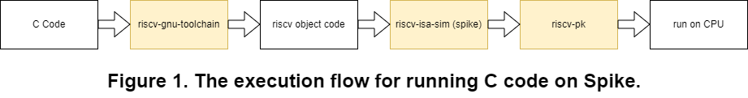

# μRISC-V: An Enhanced RISC-V Processor Design using Spike

<font size= 4>**Computer Organization 2024 Programming Assignment I**

<mark>**Due Date: 23:59, April 10, 2024**</mark></font>

## Overview
This assignment is to be familiar with the hardware/software interface: instruction set architecture (ISA), as well as the environment and tools (e.g., compiler and RISC-V simulator) for RISC-V programming. Thus, the first programming assignment is to **write inline assembly code** and run the developed code on a RISC-V ISA Simulator, *Spike*, to evaluate the result. 

## Prerequisite
<mark>**If you have completed the environment setup from HW0 without any issues, you can proceed directly to section 2.**</mark></font>

The homework assignments of this course are based on the RISC-V Spike simulator running on Ubuntu Linux 22.04. As our assignments are built upon open source projects, there will be unexpected compatibility issues if you choose a different development environment. 

For those students who use Mac or Windows systems, in order to save your time for establishing your development environment, our suggestion is the virtual machine based solution to work on your assignments. Please follow the procedures below to establish your *virtual* environment with Oracle Virtual Box. You can use some other virtual machine software (e.g., VMware's solution) to build your virtual environment.
+ Install [Oracle Virtual Box](https://www.oracle.com/virtualization/technologies/vm/downloads/virtualbox-downloads.html)
	* Choose and download the Oracle VM VirtualBox Base Package based on the *operating system* of your host machine. 
    * If you have a machine with Apple Silicon processors, including M1 and M2, and you cannot install the latest VirtualBox software on your machine, you may try to install an order version (VirtualBox-7.0.2_BETA4-154219-macOSArm64.dmg) from [VirtualBox download site](https://download.virtualbox.org/virtualbox/7.0.2).
+ Download the pre-build Ubuntu 22.04 image for virtual machines.
	* Option #1: [Ubuntu 22.04 Linux VM Images for VirtualBox and VMware](https://www.linuxvmimages.com/images/ubuntu-2204/)
		- Be aware of the username and password for the pre-built system, and the HW resources allocated for the virtual machine. 
		- Username: ubuntu; Password : ubuntu; 
		- vCPU: 2, RAM: 4 GB, DISK: 128GB, Network: NAT
	* Option #2: You can find some other online resources to help you.
		- For example, Ubuntu provides a tutorial [How to run an Ubuntu Desktop virtual machine using VirtualBox 7](https://ubuntu.com/tutorials/how-to-run-ubuntu-desktop-on-a-virtual-machine-using-virtualbox#1-overview)
+ Create a virtual machine for Ubuntu 22.04 with Virtual Box.
	* You can refer to the [tutorial from Ubuntu](https://ubuntu.com/tutorials/how-to-run-ubuntu-desktop-on-a-virtual-machine-using-virtualbox#2-create-a-new-virtual-machine) to create a virtual machine with Ubuntu 22.04.
	* Or, you can find some other online resources to help you.

## 1. RISC-V Development Tools Installation




The figure above illustrates the execution flow of a C program with Spike, a RISC-V processor simulator, on top of your host machine. 
There are three yellow boxes represents three different tools: *riscv-gnu-toolchain*, *riscv-isa-sim*, and *riscv-pk*. 

The first software, riscv-gnu-toolchain, is the RISC-V C and C++ cross-compiler. It supports two build modes: a generic ELF/Newlib toolchain and a more sophisticated Linux-ELF/glibc toolchain. The instructions to install this software on your virtual environment are summarized in Section 1-1. You can also refer to its open source repository, [RISC-V GNU Compiler Toolchain](https://github.com/riscv-collab/riscv-gnu-toolchain), for more information.

The second software, riscv-isa-sim, is a RISC-V simulator called *Spike* that implements a functional model of a variety of RISC-V designs. It is named after the golden spike used to celebrate the completion of the US transcontinental railway. The installation instructions are given in Section 1-2. You can find out the detailed information (e.g., the supported RISC-V extensions) in its open source repository: [riscv-isa-sim](https://github.com/riscv-software-src/riscv-isa-sim).

The third software, riscv-pk, is a lightweight application execution environment that can host statically-linked RISC-V ELF binaries. It is designed to support tethered RISC-V implementations with limited I/O capability and thus handles I/O-related system calls by proxying them to a host computer. In order words, given a C program, the ordinary RISC-V instructions are emulated by Spike and the system calls (system services) are served by your virtual environment (i.e., the Ubuntu 22.04), where the system calls are forwarded by *riscv-pk* so that the underlying OS can take care of the system calls invoked by your C program. For more information, you can refer to its open source repository, [riscv-pk](https://github.com/riscv-software-src/riscv-pk).

### 1-1. Install RISC-V GNU Compiler Toolchain


This is the RISC-V C and C++ cross-compiler. You should find a location to install the cross-compiler. You can create a package folder under the `/opt` folder (i.e., `/opt/riscv`) and add this into the environment variable `$RISCV`. The following example assumes the package is installed under the path: `/opt/riscv`. If you choose another path for the installation, you should replace the string of `/opt/riscv` with your selected path in the following commands.

After you choose the folder for the package, you should also create a subfolder `bin` within your package folder (e.g., `/opt/riscv/bin`) and add the `bin` folder into to your system PATH. The related commands are listed below. 

```
$ sudo mkdir /opt/riscv && sudo mkdir /opt/riscv/bin
$ export RISCV=/opt/riscv >> ~/.bashrc
$ export PATH="$PATH":"$RISCV"/bin >> ~/.bashrc
$ source ~/.bashrc
```

Later, you should create a project folder (e.g., `$HOME/riscv`). You should clone the above three tools and write your homework in project folder. The directory tree is shown as below.
```txt
$HOME/riscv/
		├── riscv-gnu-toolchain
		├── riscv-pk
		├── riscv-isa-sim 
		└── CO_StudentID_HW1/
```
The following commands are used to clone the riscv-gnu-toolchain project and installing related software packages. Note that `./configure --prefix=...` is used to configure the prefix (the path of the package folder); the prefix is assumed to be: `/opt/riscv`. In addition the last command `sudo make -j4` is used to build the project from source files with four threads in parallel.

```
$ mkdir ~/riscv
$ cd ~/riscv
$ git clone https://github.com/riscv/riscv-gnu-toolchain
$ sudo apt-get install autoconf automake autotools-dev curl python3 libmpc-dev libmpfr-dev libgmp-dev gawk build-essential bison flex texinfo gperf libtool patchutils bc zlib1g-dev libexpat-dev
$ cd riscv-gnu-toolchain 
$ ./configure --prefix=/opt/riscv --enable-multilib
$ sudo make linux -j4
```
After you do the above operations, riscv-gnu-toolchain will be installed under the path: `$HOME/riscv/riscv-gnu-toolchain` and riscv-gnu-toolchain packages will be installed under the path: `/opt/riscv/riscv64-unknown-linux-gnu`.

### 1-2. Install RISC-V ISA Simulator

Here, we start to install the RISC-V ISA simulator. Please go to the project directory (e.g., `/$HOME/riscv`) and run the following commands to clone the riscv-isa-sim project.

```
$ cd ~/riscv
$ sudo apt install device-tree-compiler
$ git clone https://github.com/riscv-software-src/riscv-isa-sim.git
$ cd riscv-isa-sim
$ mkdir build
$ cd build
$ ../configure --prefix=/opt/riscv
$ make
$ sudo make install
```
After you do the above operations, riscv-isa-sim will be installed under the path: `$HOME/riscv/riscv-isa-sim`.

### 1-3. Install RISC-V Proxy Kernel

We start to install the proxy kernel software. Please go to the project directory (e.g., `$HOME/riscv`) and run the following commands to clone the riscv-pk project.

```
$ cd ~/riscv
$ git clone https://github.com/riscv-software-src/riscv-pk.git
$ cd riscv-pk
$ mkdir build
$ cd build
$ ../configure --prefix=/opt/riscv --host=riscv64-unknown-linux-gnu
$ make
$ sudo make install
```

After you do the above operations, riscv-isa-sim will be installed under the path: `$HOME/riscv/riscv-pk`.

### 1-4. Run a simple code on Spike

To validate the above tools are installed correctly, you can compile (with the compiler `riscv64-unknown-linux-gnu`) and run an example program (e.g., `hello.c`) with Spike. In the current version, Spike only supports the statically built machine executable, so we need to compile the example program with the flag `-static`. 

The second command suggests that the Spike simulator supports the `RV64GC` RISC-V variant (More about the RISC-V ISA base and extensions can refer to [the page](https://en.wikipedia.org/wiki/RISC-V)). Also, the binary executable `hello` is run with the support of the built proxy kernel software under the path: `/opt/riscv/riscv64-unknown-linux-gnu/bin/pk`.

```
$ riscv64-unknown-linux-gnu-gcc -static -o hello hello.c
$ spike --isa=RV64GC /opt/riscv/riscv64-unknown-linux-gnu/bin/pk hello
```

If the above two commands are performed successfully, the terminal will show the following contents.

```
Hello
```

## 2. GCC Inline Assembly

The inline assembly code provide a way to write efficient code. One of the benefits of the inline assembly is the reducing of the overheads incurred by function calls. The RISC-V C/C++ compiler is based on GCC compilers, and GCC inline assembly uses AT&T/UNIX assembly syntax. The basic format of an inline assembly code is define as below. You can see the following code example to get a high-level concept of `the format of inline assembly`. For detailed information, you would refer to [the extended asm. from GCC HOWTO document](http://www.ibiblio.org/gferg/ldp/GCC-Inline-Assembly-HOWTO.html#s5). 

`asm volatile( AssemblerTemplate 
                      : OutputOperands
                      : InputOperands
                      : Clobbers)`

### Example:

Original C program: `add.c`
```c
#include <stdio.h>

int main ()
{
	int a = 10, b = 5;
	a = a + b;
	printf("%d\n", a);
	return 0;
}
```

Inline assembly version: `add_inline.c`
```c
#include <stdio.h>

int main ()
{
	int a = 10, b = 5;	
	//a = a + b;
	asm volatile(
		"add %[a], %[a], %[b]\n\t"	//AssemblerTemplate
		:[a] "+r"(a)				//OutputOperands, "=r" means write-only, "+r" means read/write
		:[b] "r"(b)					//InputOperands 
	);
	printf("%d\n", a);
	return 0;
}
```

* "a" is the output operand, referred to by the register %[a] and "b" is the input operand, referred to by the register %[b]. In inline assembly, you can adopt the `asmSymbolicName syntax` method which is to renaming the registers (e.g., `[a], [b]`). The benefit for the asmSymbolicName syntax method is more readable and more maintainable since reordering index numbers is not necessary when adding or removing operands.
* "r" is a constraint on the operands. "r" says to GCC to use any register for storing the operands. The constraint modifier "=" says the output operand is write-only. The constraint modifier "+" says the output operand can both read and write.
* Beware! At the end of each instruction, you should add the string `\n\t`.

## 3. Assignment 
The students are divided into three groups according each student's Student ID.
* Group 1: StudentID mod 3 = 1.
* Group 2: StudentID mod 3 = 2.
* Group 3: StudentID mod 3 = 0.

Please write your code in `asm volatile()`. Any modifications outside of `asm volatile()` are not allowed.
### 3-1 Basic (20%)
Please finish the following code which belongs to your group. You need to add your inline assembly code in the C file, belonging to your group.

* Group 1: sub_inline.c
```c
#include <stdio.h>

int main ()
{
    int a, b;
    FILE *input = fopen("../input/1.txt", "r");
    fscanf(input, "%d %d", &a, &b);
    fclose(input);
    //a = a - b;
    asm volatile(/*Your Code*/);
    printf("%d\n", a);
    return 0;
}
```

* Group 2: mul_inline.c
```c
#include <stdio.h>

int main ()
{
    int a, b;
    FILE *input = fopen("../input/1.txt", "r");
    fscanf(input, "%d %d", &a, &b);
    fclose(input);
    //a = a * b;
    asm volatile(/*Your Code*/);
    printf("%d\n", a);
    return 0;
}
```

* Group 3: div_inline.c
```c
#include <stdio.h>

int main ()
{
    int a, b;
    FILE *input = fopen("../input/1.txt", "r");
    fscanf(input, "%d %d", &a, &b);
    fclose(input);
    //a = a / b;
    asm volatile(/*Your Code*/);
    printf("%d\n", a);
    return 0;
}
```

### 3-2 Array (20%)
Please finish the following code which belongs to your group. The original C code is in the comments.
* Group 1: subarray_inline.c

```c
#include <stdio.h>

int main ()
{
    int a[10] = {0}, b[10] = {0}, c[10] = {0}; 
    int i, arr_size = 10;
    FILE *input = fopen("../input/2.txt", "r");
    for(i = 0; i < arr_size; i++) fscanf(input, "%d", &a[i]);
    for(i = 0; i < arr_size; i++) fscanf(input, "%d", &b[i]);
    for(i = 0; i < arr_size; i++) fscanf(input, "%d", &c[i]);
    fclose(input);
    int *p_a = &a[0];
    int *p_b = &b[0];
    int *p_c = &c[0];

	/* original code 
    for (int i = 0; i < arr_size; i++){
        p_c[i] = p_a[i] - p_b[i];
    }
    */
    for (int i = 0; i < arr_size; i++){
        asm volatile(/*Your Code*/);
	}
    p_c = &c[0];
    for(i = 0; i < arr_size; i++) printf("%d ", *p_c++);
    printf("\n")
    return 0;
}
```
* Group 2: mularray_inline.c

```c
#include <stdio.h>

int main ()
{
    int a[10] = {0}, b[10] = {0}, c[10] = {0}; 
    int i, arr_size = 10;
    FILE *input = fopen("../input/2.txt", "r");
    for(i = 0; i < arr_size; i++) fscanf(input, "%d", &a[i]);
    for(i = 0; i < arr_size; i++) fscanf(input, "%d", &b[i]);
    for(i = 0; i < arr_size; i++) fscanf(input, "%d", &c[i]);
    fclose(input);
    int *p_a = &a[0];
    int *p_b = &b[0];
    int *p_c = &c[0];

	/* original code 
    for (int i = 0; i < arr_size; i++){
        p_c[i] = p_a[i] * p_b[i];
    }
    */
    for (int i = 0; i < arr_size; i++){
        asm volatile(/*Your Code*/);
	}
    p_c = &c[0];
    for(i = 0; i < arr_size; i++) printf("%d ", *p_c++);
    printf("\n")
    return 0;
}
```
* Group 3: divarray_inline.c

```c
#include <stdio.h>

int main ()
{
    int a[10] = {0}, b[10] = {0}, c[10] = {0}; 
    int i, arr_size = 10;
    FILE *input = fopen("../input/2.txt", "r");
    for(i = 0; i < arr_size; i++) fscanf(input, "%d", &a[i]);
    for(i = 0; i < arr_size; i++) fscanf(input, "%d", &b[i]);
    for(i = 0; i < arr_size; i++) fscanf(input, "%d", &c[i]);
    fclose(input);
    int *p_a = &a[0];
    int *p_b = &b[0];
    int *p_c = &c[0];

	/* original code 
    for (int i = 0; i < arr_size; i++){
        p_c[i] = p_a[i] / p_b[i];
    }
    */
    for (int i = 0; i < arr_size; i++){
        asm volatile(/*Your Code*/);
	}
    p_c = &c[0];
    for(i = 0; i < arr_size; i++) printf("%d ", *p_c++);
    printf("\n")
    return 0;
}
```


### 3-3 Matrix Multiply (30%)
Given the matrix multiplication code `matrix.c` below, please convert the **loop body** of the nested for-loop into the corresponding inline assembly version.

Original C Code:
```c
/*
 * description:          matrix - multiply benchmarking
 *
 *    |h11 h12 h13|   |x1 x2|   |y1 y2|   | h11*x1+h12*x3+h13*x5 h11*x2+h12*x4+h13*x6|
 *    |h21 h22 h23| * |x3 x4| = |y3 y4| = | h21*x1+h22*x3+h23*x5 h11*x2+h12*x4+h13*x6|
 *    |h31 h32 h33|   |x5 x6|   |y5 y6|   | h31*x1+h32*x5+h33*x5 h11*x2+h12*x4+h13*x6|
 * 
 * Element are to store in following order:
 * 
 * matrix h[9]={h11,h12,h13, h21,h22,h23, h31,h32,h33}
 * vector x[6]={x1,x2, x3,x4, x5,x6}
 * vector y[6]={y1,y2, y3,y4, y5,y6}
 */
 
#include<stdio.h>
 
int main()
{  
    int f,i,j;
    int h[9] = {0}, x[6] = {0}, y[6] = {0};  
    for(i = 0; i < 9; i++) scanf("%d", &h[i]);
    for(i = 0; i < 6; i++) scanf("%d", &x[i]);
    for(i = 0; i < 6; i++) scanf("%d", &y[i]);
 
    int *p_x = &x[0];
    int *p_h = &h[0];
    int *p_y = &y[0];
  
    for (i = 0; i < 3; i++){
      /* p_x points to the beginning of the input vector */
      p_x = &x[0]; 
            
      /* do matrix multiply */     
      for (j = 0; j < 2; j++){ 
          p_h = &h[i*3];
          for (f = 0; f < 3; f++)
	      *p_y += *p_h++ * *p_x++;
              *p_x++;
      
          /* next element */
          p_x = &x[1];
          p_y++;
        }
    }
    return 0; 
}
```

Please modify the above c code to inline assembly version. You should copy the following code and write your code in `asm volatile()`. Beware Your Code is **in** the for loop.


```c
#include<stdio.h>
 
int main()
{  
    int f, i, j;
    int h[9] = {0}, x[6] = {0}, y[6] = {0};
    FILE *input = fopen("../input/3.txt", "r")
    for(i = 0; i < 9; i++) fscanf(input, "%d", &h[i]);
    for(i = 0; i < 6; i++) fscanf(input, "%d", &x[i]);
    for(i = 0; i < 6; i++) fscanf(input, "%d", &y[i]);
    fclose(input);
    
    int *p_x = &x[0];
    int *p_h = &h[0];
    int *p_y = &y[0];
  
    for (i = 0; i < 3; i++){             
        for (j = 0; j < 2; j++){
            for (f = 0; f < 3; f++){
                asm volatile(/*Your Code*/);                
        }   
      }
    }
    p_y = &y[0];
    for(i = 0; i < 6; i++) printf("%d ", *p_y++);
    printf("\n");
    return 0; 
  
}
```

### 3-4 Matrix Multiply (30%)
Given the matrix multiplication code `matrix.c` in 3-3, please convert the nested for-loop into the inline assembly version. 
You should copy the following code and write your code in `asm volatile()`. Note that the entire nested for-loop should be converted into the inline assembly code in this exercise.

```c
#include<stdio.h>
 
int main()
{  
    int f, i = 0;
    int h[9] = {0}, x[6] = {0}, y[6] = {0};
    FILE *input = fopen("../input/4.txt", "r")
    for(i = 0; i < 9; i++) fscanf(input, "%d", &h[i]);
    for(i = 0; i < 6; i++) fscanf(input, "%d", &x[i]);
    for(i = 0; i < 6; i++) fscanf(input, "%d", &y[i]);
    fclose(input);
    
    int *p_x = &x[0];
    int *p_h = &h[0];
    int *p_y = &y[0];

    asm volatile(/*Your Code*/);

    p_y = &y[0];
    for(i = 0; i < 6; i++) printf("%d ", *p_y++);
    printf("\n");
    return 0; 
  
}
```

## 4. Test Your Assignment

We use [local-judge](https://github.com/ph81918/local-judge.git) (`pip3 install local-judge`) to judge your program. 

You can download the test data `Co2024HW1.zip` from the Moodle of this course. Unzip and place these data into the project folder(e.g., `$HOME/riscv`). The file `judge.conf` should be placed in the same folder as your assignment code(e.g., `$HOME/riscv/CO_StudentID_HW1`).The directory tree is shown as below.
```txt
$HOME/riscv/
            ├── riscv-gnu-toolchain
            ├── riscv-pk
            ├── riscv-isa-sim 
            ├── CO_StudentID_HW1/
                ├── 1.c
                ├── judge.conf
                └── Makefile
            ├── input
            └── answer
        
```
Now, you can use the judge program to get the testing score by typing `judge` in your terminal.
```
$ sudo apt install python3-pip
$ pip3 install local-judge
$ cd ~/riscv/CO_StudentID_HW1
$ judge
```

```
$ cd ~/riscv/CO_StudentID_HW1
$ make judge
=======+=============================================================
Sample | Accept
=======+=============================================================
     1 | ✔
=======+=============================================================
     2 | ✔
=======+=============================================================
     3 | ✔
=======+=============================================================
     4 | ✘
=======+=============================================================
Obtained/Total scores: 70/100
```
You can typing `judge -c [CONFIG]`(e.g., `judge -c judge1.conf`) in your terminal to only judge certain problems.
```
$ cd ~/riscv/CO_StudentID_HW1
$ judge -c judge1.conf
=======+=============================================================
Sample | Accept
=======+=============================================================
     1 | ✔
=======+=============================================================
Correct/Total problems: 1/1
Obtained/Total scores: 20/20
```
If your assignment output is wrong, you can also add the perameter `-v 1` to the `judge` command to view the differences between your assignment output and the standard answer.
```
example:
standard answer is 5.
your assignment output is 15.
```
```
$ cd ~/riscv/CO_StudentID_HW1
$ judge -c judge1.conf -v 1
=======+=============================================================
Sample | Accept
=======+=============================================================
     1 | ✘
=======+=============================================================
diff --git a/home/ubuntu/riscv/answer/1.out b/../output/1local_1709739995.out
index 7ed6ff8..60d3b2f 100755
--- a/home/ubuntu/riscv/answer/1.out
+++ b/../output/1local_1709739995.out
@@ -1 +1 @@
515

=======+=============================================================
Correct/Total problems: 0/1
Obtained/Total scores:  0/20
```
## 5. Submission of Your Assignment

+ Compress your source code into a `zip` file.
+ Submit your homework with NCKU Moodle.
+ The directory organization of your code should be as follows.
	* Change all `CO_StudentID` to your student ID number)(e.g., F12345678.zip)

```txt
F12345678_HW1.zip/
└── F12345678_HW1/
    ├── 1.c
    ├── 2.c
    ├── 3.c
    ├── 4.c
    └── Makefile
```

<mark>**!!! Incorrect format (either the file structure or file name) will lose 20 points. !!!**</mark>


## 6. Reference

+ [GCC-Inline-Assembly-HOWTO](http://www.ibiblio.org/gferg/ldp/GCC-Inline-Assembly-HOWTO.html)
+ [Extended Asm - Assembler Instructions with C Expression Operands](https://gcc.gnu.org/onlinedocs/gcc/Extended-Asm.html)
+ [RISC-V Assembly Programmer's Manual](https://github.com/riscv-non-isa/riscv-asm-manual/blob/master/riscv-asm.md)
+ [The RISC-V Instruction Set Manual Version 2.2](https://riscv.org/wp-content/uploads/2017/05/riscv-spec-v2.2.pdf)
